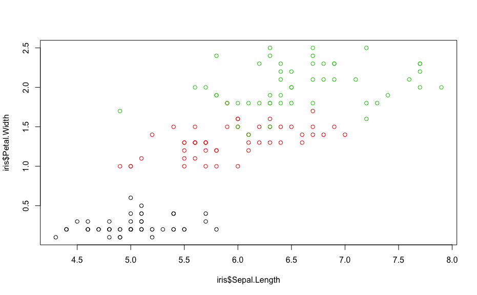

Plotting using the golden ratio
================

Use the Golden Ratio when plotting figures in R.

[Golden Ratio is defined as:](https://en.wikipedia.org/wiki/Golden_ratio)

`In mathematics, two quantities are in the golden ratio if their ratio is the same as the ratio of their sum to the larger of the two quantities.`

$\\frac{a+b}{a} = \\frac{a}{b}$

The ratio can also be expressed as a real number, approximately: `1.61803398875`

Calculating the Golden Ratio:

``` r
GoldenRatio=(1+sqrt(5))/2
GoldenRatio
```

    ## [1] 1.618034

Visualizing:
============

12x12

``` r
# square:
plot(iris$Sepal.Length, iris$Petal.Width, col = iris$Species)
```


12x(12/GoldenRatio)

``` r
# golden width to height
plot(iris$Sepal.Length, iris$Petal.Width, col = iris$Species)
```



(12/GoldenRatio)x12

``` r
# golden height to width
plot(iris$Sepal.Length, iris$Petal.Width, col = iris$Species)
```


